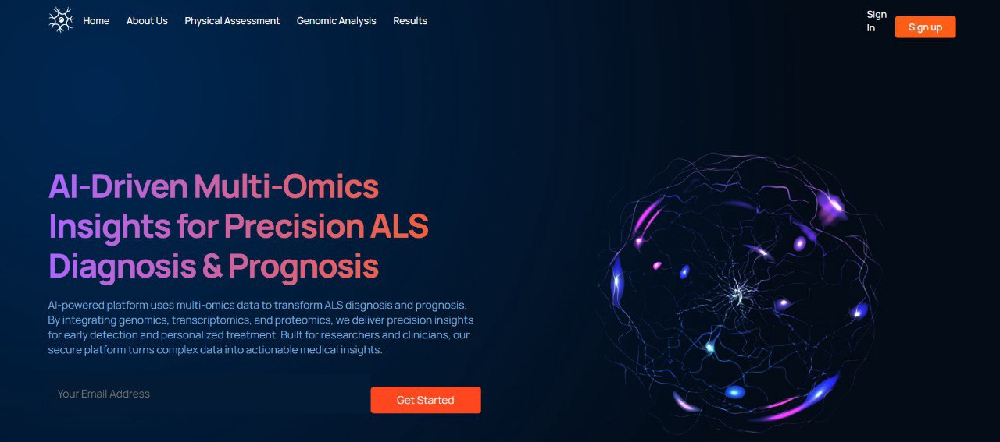
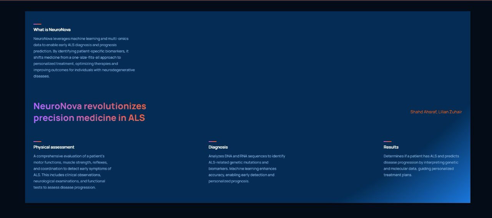

# 🧬 Neuronova: AI-Driven Multi-Omics Model for ALS Diagnosis and Prognosis  

> A deep learning framework for molecular diagnosis and progression prediction in Amyotrophic Lateral Sclerosis (ALS), integrating transcriptomic, proteomic, and epigenomic layers into a unified multi-omics representation.

---

## 🚀 Overview
Neuronova is an **AI-assisted diagnostic and prognostic system** that models the molecular landscape of ALS.  
By combining **multi-omics integration**, **deep generative modeling**, and **explainable AI**, it can diagnose ALS and predict disease progression directly from a patient’s **RNA-seq data**.

---

## 🧫 Data Generation and Processing

### 1. **RNA-Seq Processing (Transcriptomic Layer)**
Multi-omics data were generated from scratch using **3 ALS patients and 2 control samples** from **NCBI GEO**, processed on the **Galaxy Workbench**:

| Step | Tool | Purpose |
|------|------|----------|
| Alignment | **HISAT2 / STAR** | Map RNA-seq reads to the reference genome |
| Transcript Assembly | **StringTie** | Reconstruct transcripts and quantify expression |
| Differential Expression | **DESeq2** | Normalize data and identify DEGs between ALS and control |

Result: A normalized **gene expression matrix** representing the transcriptomic layer.

---

### 2. **Proteomic and Epigenomic Layers**
- **Proteomics:** Generated from peptide identification using **SearchGUI** and **PeptideShaker** — mapping peptide abundance to genes.  
- **Epigenomics:** Derived via **Bowtie2** (alignment) and **MACS2** (peak calling) to quantify methylation and chromatin accessibility.  

These layers were aligned by gene identifiers and integrated into a unified multi-omics dataset.

---

## 🧠 Machine Learning Pipeline

### 3. **Multi-Modal Variational Autoencoder (VAE)**
A **multi-modal VAE** was implemented to learn a **shared latent representation** across transcriptomic, proteomic, and epigenomic layers.

**Architecture Highlights:**
- Separate encoders per omics type (fully connected layers)
- Shared latent space capturing molecular correlations  
- Decoders reconstruct each modality from the latent embedding
- Training objective combines:
  - Reconstruction loss  
  - Kullback-Leibler (KL) divergence  

**Outcome:** A biologically meaningful latent embedding of each patient’s molecular state.

---

### 4. **Diagnostic & Prognostic Prediction**
The learned embeddings were used for supervised fine-tuning:

| Output | Description |
|---------|-------------|
| **ALS Diagnostic Probability** | Binary classification (ALS vs Control) |
| **Prognostic Index** | Continuous score estimating molecular disease progression |

**Performance:**
- AUC: **0.89–0.92**
- Diagnostic Accuracy: **82–88%**
- Validation: 5-fold cross-validation on multi-omics dataset

---

## 🔍 Explainable AI & Biological Insights

To interpret the model’s biological reasoning:

- **SHAP values** → Identify top contributing genes, proteins, and epigenetic markers to predictions  
- **Decoder-weight analysis** → Trace how latent variables relate to biological pathways  
- **Pathway Enrichment (Reactome / GO)** → Map key molecular processes linked to ALS  

> This step bridges AI interpretability with molecular biology, turning model features into clinically relevant insights.

---
## 💻 Neuronova Diagnostic Interface

An interactive diagnostic dashboard was developed to allow clinicians to upload patient RNA-seq profiles.

**Interface Features:**
- **Input:** RNA-seq expression file (single patient)
- **Backend:** Pre-trained multi-modal VAE infers missing omics layers
- **Outputs:**
  - ALS diagnostic probability  
  - Prognostic score (molecular severity)
  - Visualization of top predictive biomarkers (via SHAP)

---

🖥️ **Prototype Screenshot Previews**

| Dashboard Overview |                    |                    |                     |
|--------------------|--------------------|--------------------|---------------------|
|  |  | .jpg) |  |

> *Visual representation of the Neuronova diagnostic system 
